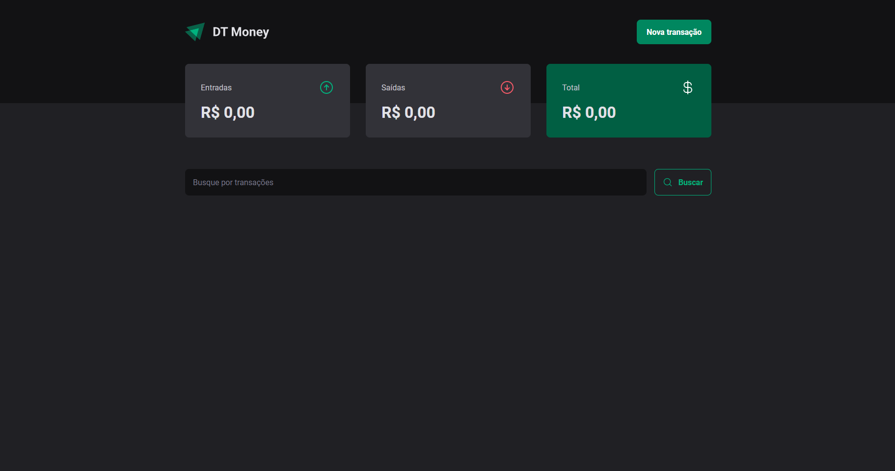
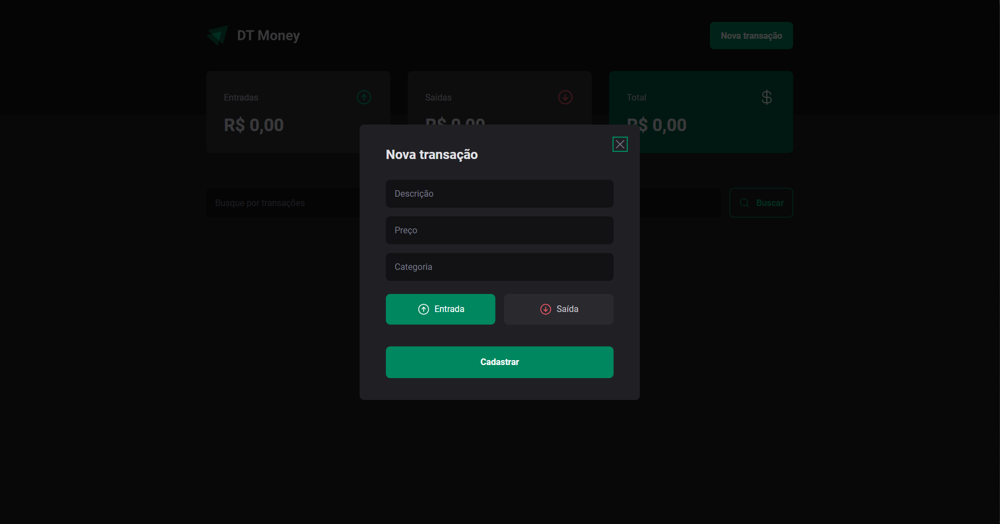
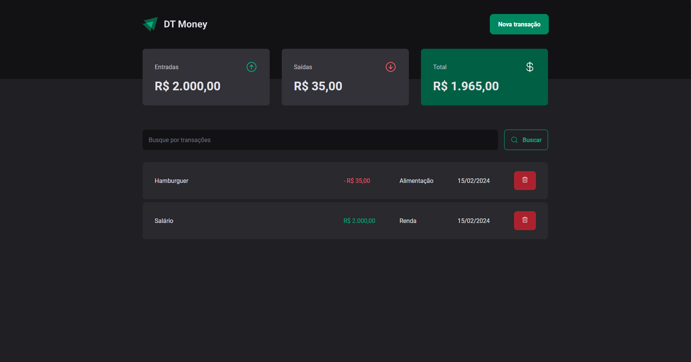
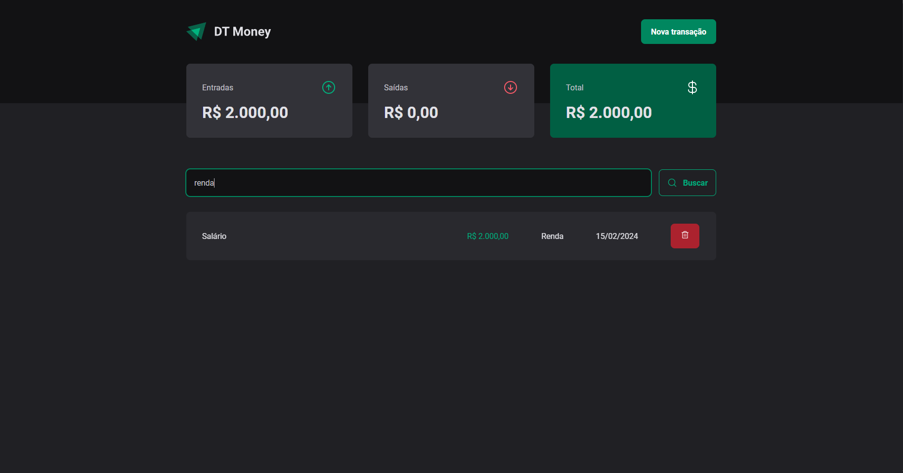

# DT - Money

Este projeto foi desenvolvido em conjunto com a Rocketseat, onde o objetivo foi criar uma interface de controle financeiro, sendo possível adicionar ganhos e gastos para a lista, foram utilizados conceitos e ferramentas como Styled Components, Estados, Contextos, useForm, json-server para simular um backend, axios para fazer as requisições HTTP, radix para criar um modal acessível, zod para validações, e melhorias de performance com hooks como useCallBack e useMemo.

O deploy foi feito utilizando Vercel: https://dt-money-peach-seven.vercel.app/

